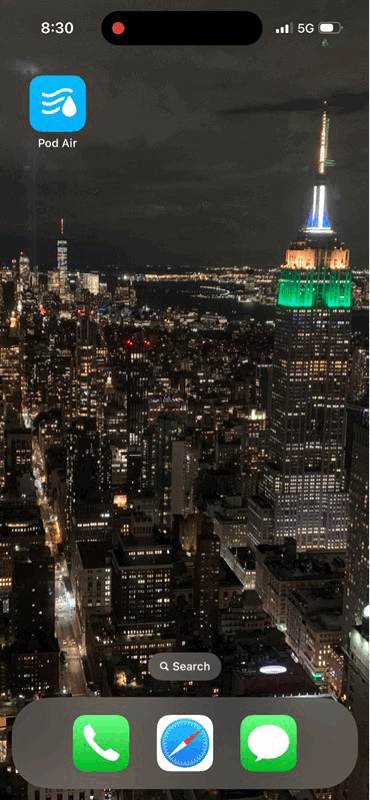

## Pod Air

#### Download [link](https://www.icloud.com/shortcuts/7403b8c847944a0cb7789f584ab8c394)

Pod Air is an iOS Shortcut designed to make it easy to record temperature and humidity readings from HomePods. While the Apple Home app only displays the current temperature and humidity without retaining historical data, Pod Air solves this limitation by allowing users to capture and visualize this data over time.

    

## Getting Started

### Prerequisites

1. **Charty iOS App installed:**
   - Download Charty from the [App Store](https://apps.apple.com/us/app/charty-for-shortcuts/id1494386093).
   - Note: Pod Air uses Charty’s premium feature to generate and export graphs as images. While Charty is essential for visualization, it is not required for tracking and reporting data within the shortcut itself.
1. **Notes iOS App installed**

### General Setup

1. Download the [Pod Air](#download-link) iOS shortcut.
1. Create a Folder in Notes
    - Open the Notes app and create a folder named `Pod Air`. Inside this folder, create a separate note for each HomePod. The title of each note will correspond to its respective HomePod and will be used by the Pod Air shortcut to store data.
1. Customize the Shortcut
    - In the Pod Air shortcut, input the list of HomePod names that the shortcut will track.  
    - Update the associated conditional blocks within the shortcut to specify the properties to be tracked for each HomePod.  

1. Adjust the Notes Filter 
    - Navigate to the bottom of the shortcut and ensure the `Find All Notes` filter is set to a folder that exists on your device (e.g., the "Pod Air" folder created earlier).
1. Set Up Automations
    - Use the Shortcuts app to create automations for collecting HomePod data. When setting up the automation, pass the required input into the Pod Air shortcut to trigger the data retrieval logic automatically.  

